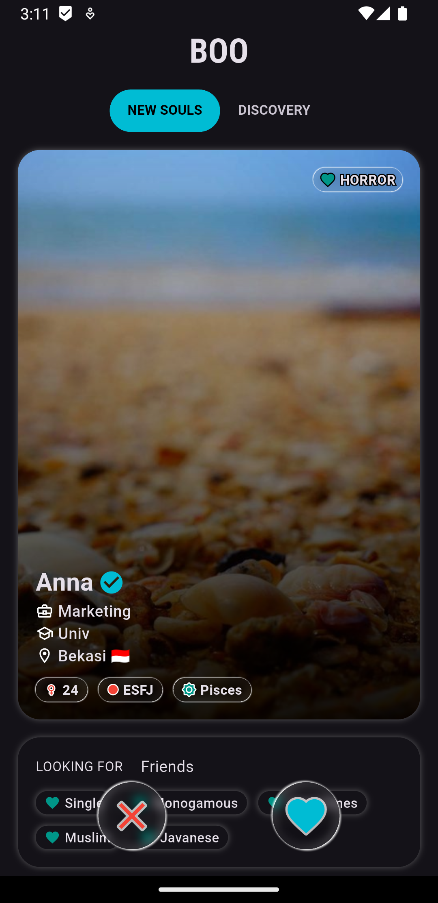
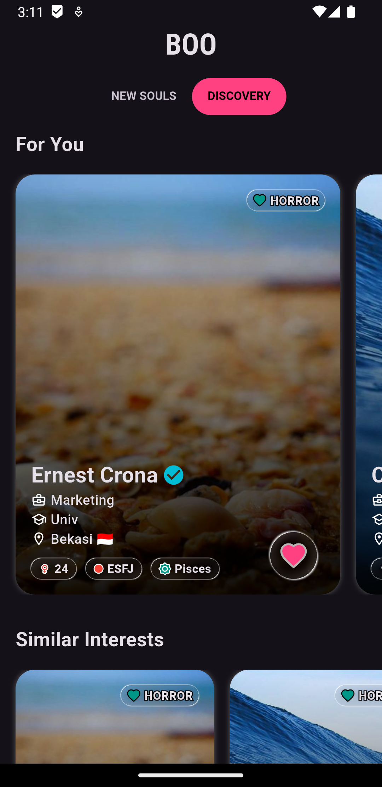
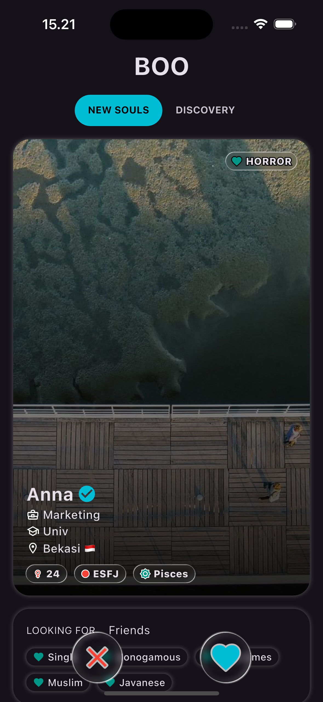
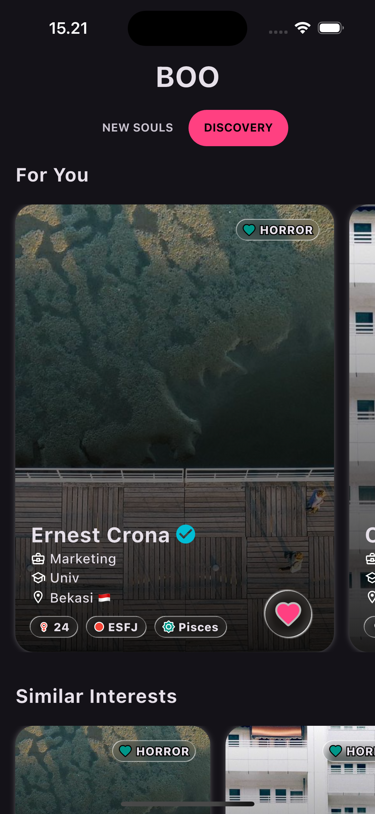

## Boo Flutter Test Assignment

This project replicates Boo's matching page using Flutter with placeholder data and icons.

### Example Android

<pre>
   
</pre>

### Example iOS

<pre>
   
</pre>

### Features

- Vertical profile scrolling
- Like & pass actions
- Simple animations
- Clean architecture
- Flutter 3.38.0

### How to run

1. `flutter pub get`
2. `flutter run`
